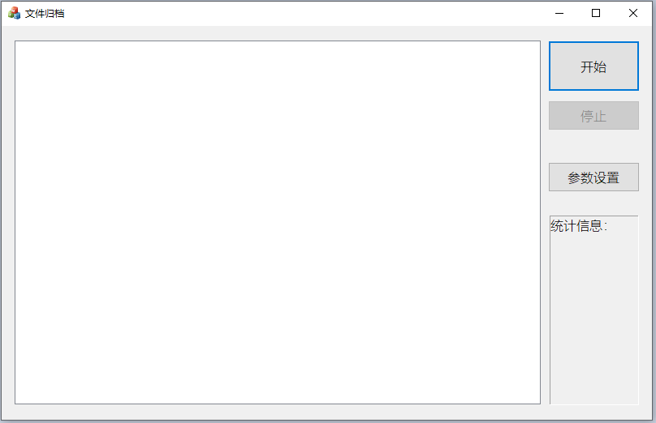
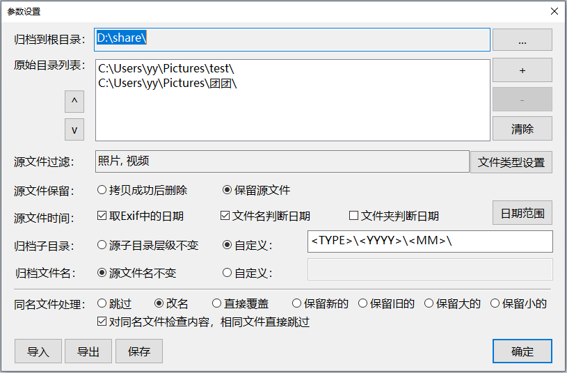

# PictureCopy

## 文件同步小工具
自己部署了一个nas，发现没有我自己喜欢的同步和改名软件，特别是备份的照片越来越多的时候，很多重复备份，也没有系统的整理，因此自己写了一个同步+改名的工具。可以按照自己的定义来进行文件夹与文件名的设定。

如果您的照片类文件很多，需要进行有规律的改名或者归档，这款小工具或许对您有用。

## 设置

设置界面有很多的参数可以定制，您可以使用默认参数，如果鼠标移动到设置界面上，会有tooltip进行参数的解释。

## 文件类型
文件的类型，您可以进行自定义，这样规则命名中，可以使用\<EXT\>来使用。

## 联系方式：
email: coyer@126.com
